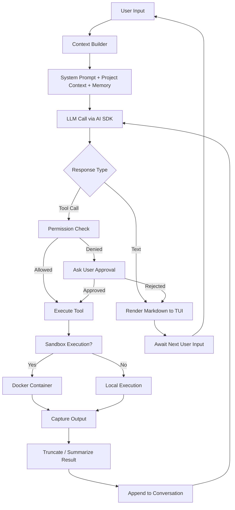

# Personal CLI Agent — Implementation Plan

> A multi-provider, Docker-sandboxed, token-efficient CLI AI agent with a beautiful terminal UI.
>
> **Design Inspirations**: Claude Code (feature depth, permission system, MCP), Gemini CLI (Ink TUI, monorepo architecture), OpenCode (Plan/Build modes, mgrep semantic search, LSP), OpenCode Zen (curated model gateway).

---

## 1. Vision & Goals

| Goal                       | Detail                                                                                                                                                             |
| -------------------------- | ------------------------------------------------------------------------------------------------------------------------------------------------------------------ |
| **Provider Agnostic**      | Swap between OpenAI, Anthropic, Google, Mistral, Ollama, and any OpenAI-compatible API with zero code changes                                                      |
| **Beautiful & Simplistic** | Inspired by Claude Code / Gemini CLI / OpenCode — rich Markdown rendering, syntax highlighting, spinners, and status bars in a clean, minimal layout               |
| **Docker-First Sandbox**   | Every code execution and file mutation runs inside ephemeral containers with gVisor/seccomp hardening                                                              |
| **Token Lightweight**      | Context compression, progressive summarization, prompt caching, smart tool-result truncation, and mgrep-style semantic search (4x faster, 3x fewer tokens)         |
| **Feature Parity**         | Match Claude Code's power + OpenCode's Plan/Build modes: agentic loops, multi-file editing, MCP, LSP, skills, hooks, subagents, permissions, and persistent memory |
| **Model Gateway**          | Optional OpenCode Zen integration — access curated, benchmarked coding models (GPT-5.x Codex, Claude Sonnet 4.5, Gemini 3 Pro) via pay-per-request gateway         |

---

## 2. Tech Stack Decisions (With Rationale)

### 2.1 Language: **TypeScript (Node.js ≥ 22)**

| Considered           | Verdict         | Why                                                                                                                                                                          |
| -------------------- | --------------- | ---------------------------------------------------------------------------------------------------------------------------------------------------------------------------- |
| **Rust + Ratatui**   | ❌ Rejected     | 30-40% less memory, but dramatically slower iteration speed; ecosystem for AI/LLM libraries is immature                                                                      |
| **Go + Bubbletea**   | ❌ Rejected     | Great performance (~4 MB baseline), but weaker type safety and smaller AI SDK ecosystem                                                                                      |
| **TypeScript + Ink** | ✅ **Selected** | React-style composable TUI. ~32 MB baseline (acceptable for a dev tool). Massive ecosystem for AI SDKs, MCP clients, Docker APIs. Same stack as Gemini CLI (proven at scale) |

> [!NOTE]
> Ink uses Yoga (React Native's layout engine) for Flexbox in the terminal. This gives us responsive, composable UI components with React's full state management.

### 2.2 AI Provider Abstraction: **Vercel AI SDK 6 + OpenCode Zen Gateway**

| Considered            | Verdict       | Why                                                                                                                                                                                                                      |
| --------------------- | ------------- | ------------------------------------------------------------------------------------------------------------------------------------------------------------------------------------------------------------------------ |
| `@unified-llm/core`   | ❌            | Smaller community, fewer edge-case fixes                                                                                                                                                                                 |
| Raw per-provider SDKs | ❌            | Massive maintenance burden                                                                                                                                                                                               |
| **Vercel AI SDK 6**   | ✅            | TypeScript-first, streaming, tool calling, structured output, human-in-the-loop approval, model switching. Supports OpenAI, Anthropic, Google, Mistral, Ollama, Azure, and any OpenAI-compatible endpoint out of the box |
| **OpenCode Zen**      | ✅ (optional) | Curated model gateway — pre-benchmarked coding-optimized models, pay-per-request pricing, transparent routing. Plugs in as an OpenAI-compatible provider via AI SDK                                                      |

### 2.3 TUI Rendering: **Ink 5 + custom components**

| Feature             | Library                                        |
| ------------------- | ---------------------------------------------- |
| Core rendering      | `ink` (React for CLI)                          |
| Markdown rendering  | `ink-markdown` + custom renderer with `marked` |
| Syntax highlighting | `shiki` (VS Code's engine)                     |
| Spinners / progress | `ink-spinner`, custom streaming component      |
| Input handling      | `ink-text-input`, custom multi-line editor     |
| Layout utilities    | Ink's built-in `<Box>`, `<Text>`, `<Newline>`  |

### 2.4 Docker Sandbox: **Dockerode + gVisor runtime**

| Layer                | Tool                                 | Purpose                                                                              |
| -------------------- | ------------------------------------ | ------------------------------------------------------------------------------------ |
| Container management | `dockerode` (Node.js Docker SDK)     | Programmatic container lifecycle                                                     |
| Enhanced isolation   | `gVisor` (`runsc` runtime)           | User-space kernel — intercepts syscalls for stronger security than vanilla Docker    |
| Fallback             | Standard `runc` + `seccomp` profiles | For environments where gVisor isn't available                                        |
| Image                | Custom Alpine-based image            | Minimal attack surface; pre-installed `git`, `node`, `python`, common dev toolchains |
| Networking           | Default-deny egress                  | Allowlist only LLM API endpoints + user-specified URLs                               |

### 2.5 Monorepo Structure: **pnpm workspaces + Turborepo**

```
personal-cli/
├── packages/
│   ├── cli/              # User-facing TUI (Ink + React)
│   ├── core/             # Agent loop, provider abstraction, tool orchestration
│   ├── sandbox/          # Docker container management, gVisor config
│   ├── tools/            # Built-in tool implementations
│   ├── mcp-client/       # Model Context Protocol client
│   └── shared/           # Types, constants, utilities
├── docker/
│   ├── Dockerfile.sandbox    # Base sandbox image
│   ├── seccomp-profile.json  # Syscall restrictions
│   └── gvisor-config.toml    # gVisor runtime config
├── configs/
│   ├── providers.yaml        # Provider configurations
│   └── permissions.yaml      # Default permission policies
├── turbo.json
├── pnpm-workspace.yaml
├── tsconfig.base.json
└── package.json
```

---

## 3. Architecture Deep-Dive

### 3.1 Core Agent Loop (ReAct Pattern)



### 3.2 Package Responsibilities

#### `packages/core` — The Brain

- **Agent loop**: ReAct loop with configurable max iterations
- **Plan / Build modes** _(inspired by OpenCode)_: `Plan Mode` generates a step-by-step plan for user review before execution; `Build Mode` executes autonomously. Toggle via `/mode plan|build|ask`
- **Provider manager**: Wraps Vercel AI SDK; handles model switching, fallbacks, cost tracking. Optional OpenCode Zen gateway for curated models
- **Context engine**: Builds optimal prompts — system prompt + project files + conversation history + tool results
- **Token budget manager**: Tracks token usage, triggers summarization when nearing limits
- **Conversation store**: Persists conversations to disk (SQLite via `better-sqlite3`)
- **LSP integration** _(inspired by OpenCode)_: Connect to language servers for type-aware code intelligence (go-to-definition, diagnostics, hover info)

#### `packages/cli` — The Face

- **Ink React components**: `<ChatView>`, `<ToolCallView>`, `<DiffView>`, `<PermissionPrompt>`, `<StatusBar>`, `<ModelSelector>`
- **Theme system**: Dark/light mode, customizable color palettes via config
- **Keyboard shortcuts**: Vim-style navigation, `Ctrl+C` cancel, `Tab` autocomplete, `/` commands
- **Streaming renderer**: Token-by-token Markdown rendering with syntax highlighting

#### `packages/sandbox` — The Fortress

- **Container pool**: Pre-warmed containers for instant execution (~200ms cold start vs ~2s)
- **Volume mounts**: Bind-mount project directory as read-only; writable overlay for changes
- **Output capture**: stdout/stderr streaming back to agent with size limits
- **Cleanup**: Auto-destroy containers after timeout (configurable, default 5 min)
- **Security policies**: seccomp profiles, capability dropping, non-root user, read-only rootfs

#### `packages/tools` — The Hands

Built-in tools matching Claude Code + OpenCode capabilities:

| Tool              | Description                                                                                                                                |
| ----------------- | ------------------------------------------------------------------------------------------------------------------------------------------ |
| `read_file`       | Read file contents with line range support                                                                                                 |
| `write_file`      | Write/create files (sandboxed for new projects)                                                                                            |
| `edit_file`       | Apply surgical diffs (search-and-replace)                                                                                                  |
| `list_dir`        | Recursive directory listing with gitignore awareness                                                                                       |
| `search_files`    | Ripgrep-powered content search                                                                                                             |
| `semantic_search` | **mgrep-style semantic search** _(inspired by OpenCode)_ — AST-aware code search that's 4x faster and uses 3x fewer tokens than naive grep |
| `glob_files`      | Pattern-based file discovery                                                                                                               |
| `run_command`     | Execute shell commands in Docker sandbox                                                                                                   |
| `web_search`      | Search the web via Tavily/Serper/SearXNG                                                                                                   |
| `web_fetch`       | Fetch and extract content from URLs                                                                                                        |
| `git_*`           | Git operations (status, diff, commit, log, branch)                                                                                         |
| `diagnostics`     | **LSP diagnostics** — get type errors, warnings, lint issues for a file                                                                    |
| `think`           | Scratchpad for extended reasoning (costs 0 execution tokens)                                                                               |

---

## 4. Feature Breakdown

### 4.1 Multi-Provider System

```yaml
# ~/.personal-cli/providers.yaml
providers:
  openai:
    apiKey: ${OPENAI_API_KEY}
    models:
      - id: gpt-4.1
        maxTokens: 128000
  anthropic:
    apiKey: ${ANTHROPIC_API_KEY}
    models:
      - id: claude-sonnet-4
        maxTokens: 200000
  ollama:
    baseUrl: http://localhost:11434
    models:
      - id: llama3.3:70b
        maxTokens: 131072
  # OpenCode Zen — curated coding-optimized model gateway
  opencode-zen:
    baseUrl: https://api.opencode.ai/v1
    apiKey: ${OPENCODE_ZEN_API_KEY}
    models:
      - id: gpt-5.2-codex
      - id: claude-sonnet-4.5
      - id: gemini-3-pro

defaults:
  provider: anthropic
  model: claude-sonnet-4
```

### 4.5 Slash Commands

| Command                          | Action                                                                                          |
| -------------------------------- | ----------------------------------------------------------------------------------------------- |
| `/help`                          | Show all commands                                                                               |
| `/model <provider/model>`        | Switch model                                                                                    |
| `/mode <ask\|auto\|plan\|build>` | Change agent mode _(plan = review before execute, build = autonomous, ask = confirm each tool)_ |
| `/clear`                         | Clear conversation                                                                              |
| `/resume`                        | Resume last conversation                                                                        |
| `/compact`                       | Summarize conversation to save tokens                                                           |
| `/cost`                          | Show session cost breakdown                                                                     |
| `/diff`                          | Show all pending file changes                                                                   |
| `/undo`                          | Undo last file change                                                                           |
| `/skill <name>`                  | Execute a custom skill                                                                          |
| `/sandbox <on\|off>`             | Toggle Docker sandbox                                                                           |
| `/mcp <add\|remove\|list>`       | Manage MCP servers                                                                              |
| `/zen`                           | List available OpenCode Zen models with benchmarks                                              |
| `/export`                        | Export conversation to Markdown                                                                 |

---

## 5. UI Design

### 5.1 Layout

```
┌──────────────────────────────────────────────────────────┐
│  🤖 personal-cli  │ claude-sonnet-4  │ 12.4k/200k tokens │
├──────────────────────────────────────────────────────────┤
│                                                          │
│  You: Can you refactor the auth module to use JWT?       │
│                                                          │
│  ┌─ 🔧 read_file("src/auth/handler.ts")                 │
│  │  ✅ Read 142 lines                                    │
│  └───────────────────────────────────────────────────────│
│                                                          │
│  I've analyzed the auth module. Here's my plan:          │
│                                                          │
│  1. Replace session-based auth with JWT tokens           │
│  2. Add `jsonwebtoken` dependency                        │
│  3. Create token generation and verification utilities   │
│                                                          │
│  ┌─ ✏️  edit_file("src/auth/handler.ts")                 │
│  │  ⚠️  Permission required — [Y]es / [N]o / [A]lways  │
│  └───────────────────────────────────────────────────────│
│                                                          │
├──────────────────────────────────────────────────────────┤
│  > Type a message... (Shift+Enter for newline)      [?]  │
└──────────────────────────────────────────────────────────┘
```

---

## 6. Development Phases

### Phase 1: Foundation (Week 1-2)

- [x] Initialize monorepo with pnpm + Turborepo
- [x] Set up `packages/shared`, `packages/core`, `packages/cli`
- [x] Integrate Vercel AI SDK with Anthropic (and other providers)
- [x] Streaming text rendering with Markdown support

### Phase 2: TUI Tool Integration (Week 3)

- [x] Create `packages/cli/src/components/ToolCallView.tsx`
- [x] Create `packages/cli/src/components/PermissionPrompt.tsx`
- [x] Update `packages/cli/src/hooks/useAgent.ts` to handle tool events and permissions
- [x] Update `packages/cli/src/app.tsx` to render tool UI and handle advanced slash commands

### Phase 3: Advanced Tools & Context (Week 4)

- [x] Implement `semanticSearch` (mgrep-style AST-aware outline search)
- [x] Implement `diagnostics` (LSP/TSC type-aware file errors)
- [ ] Implement Model Context Protocol (MCP) dynamic client
- [ ] Implement progressive summarization `/compact`
- [ ] Implement token budget management and auto-summarization
